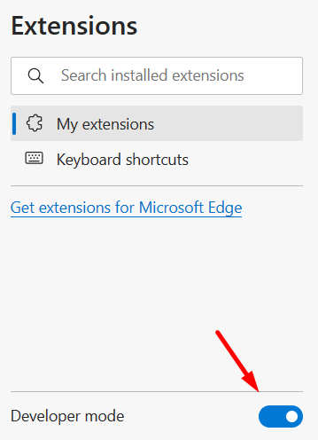
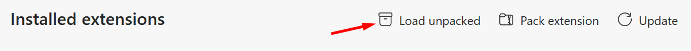
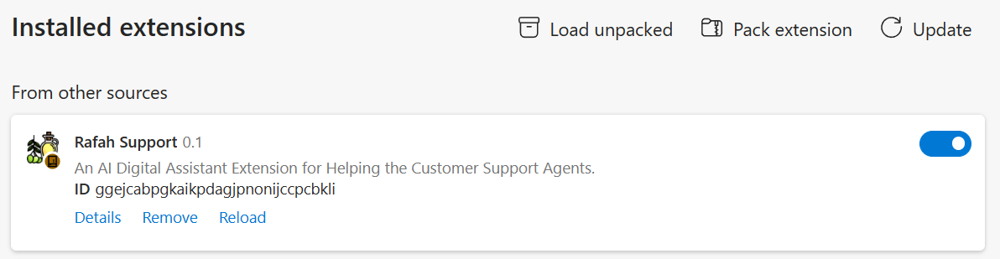
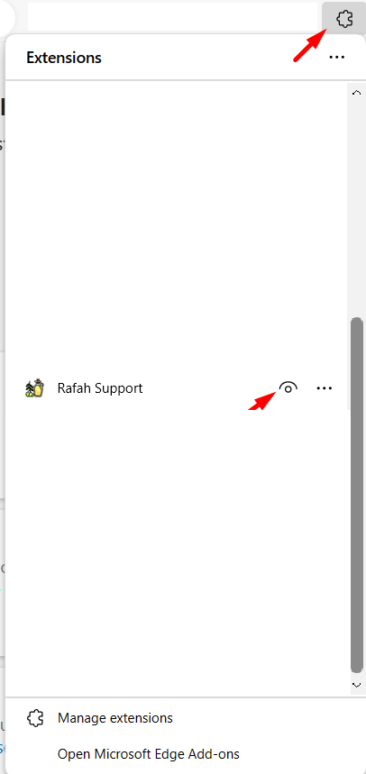
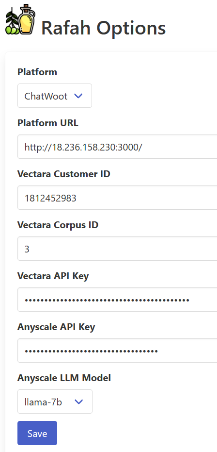
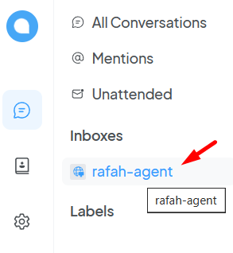
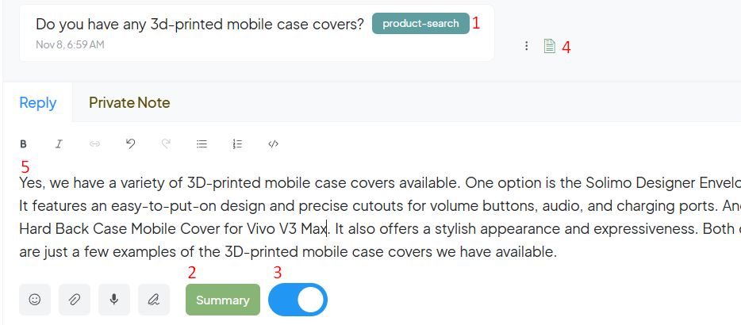

<p align="center">
    
</p>

<p align="center">
    <h1 align="center">Rafah</h1>
</p>

## Augment Customer Engagement with AI-Powered Solutions

Rafah is a browser extension that seamlessly injects state-of-the-art AI features into customer engagement platforms. Say goodbye to the hassle of switching between tools and embrace the future with Rafah's in-platform AI capabilities.

### 🌟 Why Rafah?

- **🛡️ Stay on Platform**: Access sophisticated AI tools without ever leaving your customer engagement platform.
  
- **🔓 Break Through Closed Systems**: Even the most resistant platforms can now enjoy external functionality.
  
- **⚙️ Effortless Configuration**: Get started with AI in just a few clicks.

### ✨ Features

- **🤖 AI Chatbots**: Enhance customer interaction with intelligent, conversational chatbots.

- **💬 Automated Responses**: Deliver instant replies to common inquiries with AI-generated responses.

### 🦋 Supported Platforms 

1. [Chatwoot](https://github.com/chatwoot/chatwoot)

### 💻 Supported Browsers

1. Google Chrome
2. Microsoft Edge

### 🚀 Getting Started

#### 🔧 Installation


1. Download the Rafah project [zip file](https://github.com/bakrianoo/rafah-support/archive/refs/heads/main.zip). Extract it to a folder.
   
2. Open the [Chrome extensions](chrome://extensions) page. (`Run with Edge browsers too`)
   
3. Turn on the developers mode.

<p align="center">
    
</p>

4. Click on load unpacked button, and select the `src/chrome` folder from the extracted zip file.

<p align="center">
    
</p>

5. Now you can see the Rafah extension in the extensions list.

<p align="center">
    
</p>

6. Pin the extension to the toolbar for easy access.

<p align="center">
    
</p>

### 💡 Before you start

1. Check the [Getting Started](https://docs.vectara.com/docs/quickstart) documentation for Vectara to start a new corpus.

2. You can use the demo data [here](./assets/demo-data/)

3. Create a new Vectara [API Access](https://docs.vectara.com/docs/console-ui/manage-api-access)

4. Register an account in [Anyscale](https://docs.anyscale.com/) and get your API key.

#### ⚙️ Configuration

1. Open the Rafah options page through the extension icon.

<p align="center">
    
</p>

2. Fill the configuration form with the required details, and click on the `Save` button.

<p align="center">
    
</p>

### Want a runnig Demo?

If you did not setup yet a customer engagement platform, you can use the following demo to test Rafah.

1. Open the [Chatwoot](http://18.236.158.230:3000/) demo page.

2. Enter the login credentials

```
Email: agent-user-1@rafah.com
Password: ##Agent-user-1##
```

3. Create an empty HTML page and inject the code below.

```html
<!DOCTYPE html>
<html lang="en">
<head>
    <meta charset="UTF-8">
    <title>DEMO</title>
</head>

<body>
        <script>
            (function(d,t) {
                var BASE_URL="http://18.236.158.230:3000";
                var g=d.createElement(t),s=d.getElementsByTagName(t)[0];
                g.src=BASE_URL+"/packs/js/sdk.js";
                g.defer = true;
                g.async = true;
                s.parentNode.insertBefore(g,s);
                g.onload=function(){
                window.chatwootSDK.run({
                    websiteToken: 'JArqz7KPJrEG7Ky1hrMdcD1r',
                    baseUrl: BASE_URL
                })
                }
            })(document,"script");
    </script>
</body>
</html>
```

4. You will need in the extension options page to set the `Platform URL` value to `http://18.236.158.230:3000`

5. Open the HTML page in the browser, and start chatting with the bot.

6. You can track the new messages from the inbox.

<p align="center">
    
</p>

### 😎 How to use

Open any inbox messages for a customer, and you find new augmented elements into the web page.

Next image is demonstrating some of the augmented elements.

<p align="center">
    
</p>

1. Each new messages will be classified automatically to a topic name.

2. You can ask to summerize the whole conversation with the customer. The summerization will include a section for unresponded messages for the customer.

3. You can switch the AI composer to generate a response for the customer. It can be used as a suggestion for the agent to respond to the customer.

4. If the user's message is requiring external data resources from [Vectara](https://vectara.com), you can click on this icon to get the search results.

5. The composed message can be editable by the agent before sending it to the customer.

### 🤝 Contributing

Community contributions make Rafah better for everyone. To contribute:

1. Fork the project repository.
2. Make your changes.
3. Create a pull request.

### 📜 License

Rafah is made available under the *Apache License 2.0*

### 💖 Acknowledgements

Kudos to the contributors, users, and supporters of Rafah who help enhance the dynamics of customer engagement platforms with AI.

This project was a part of [Vectara](https://vectara.com) Hackathon for developing RAG applications.
